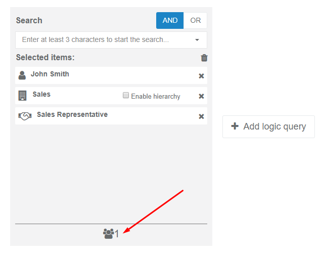
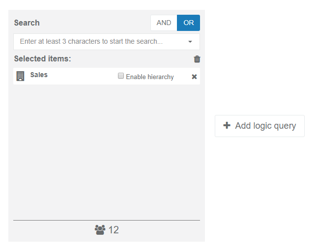
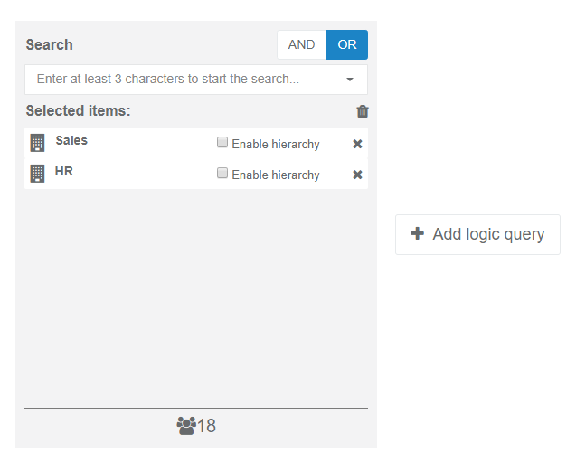

.. _enroll_learner_to_course:

Enroll Learners to Courses
==========================

There are two ways to enroll learners to courses:

* Self enrollment
* Administrative enrollment

.. _self_enrollment:

Self enrollment
^^^^^^^^^^^^^^^^

.. 
This action can be performed by 
:ref:`learner <learner>`.

..
Learners can self-enroll to the public courses. Public courses are all those with :ref:`visibility <courses>` set to "Public" which means all learners can see them in the **Catalog** and self-enroll to them.

..
To self-enroll to the course a learner must perform the following steps:

#. Go to **Catalog** > **Courses**. Specific courses can be found using search and filtering options on the **Catalog** page.
#. Click the tile of the course you wish to self-enroll to.
#. You will be redirected to the course page. 
#. In the right sidebar there is some general information about the course (rating, status) and action button **Enroll**. All public courses have this action button. Courses which have their visibility set to *read-only* can be viewed but do not have **Enroll** button and learners cannot self-enroll to them.
#. Click on **Enroll** to self-enroll to the course.
#. You will be asked to confirm your action.
#. Click **Yes**.

.. _administrative_enrollment:

Administrative enrollment
^^^^^^^^^^^^^^^^^^^^^^^^^^^^^^^^

.. 
This action can be performed by 
:ref:`Enrollment Admin <enrollment_administrator>`.

#. Click on **Administrative enrollment** in the main navigation menu.
#. You will be redirected to the new page with a list of all created assignments. 
#. The assignments table has following columns: **Learning period**, **Description**, **Display name**, **Number of enrolled learners**, **Creation date**; **Last update**, **Due date**, **Status**, **Assignmnet procedure** and **Actions**. 
#. At the bottom of the page there are two buttons: **Add static assignment** and **Add dynamic assignment**. 

Add static assignment
***************************

.. tip:: This type of assignment is used if the task is not recurring. For example, you need to enroll specific people to specific course. They need to complete it becouse it is required of them for some reason, but it is unlikely that this task will be assigned to anyone else in your company any time soon.

#. Click on the action button **Add static assignment** below the list of assignments.
#. The first step of Add/Edit wizard opens up below.
#. Assignments can be created for courses or programs. Check the appropriate radio button in the **Assignment for** section.
#. **Enrollment reason** is required. Text entered into this field is sent to the learner as a part of the email message informing them they've been enrolled into the course/program.
#. **Summary** is an optional field. It contains additional information about assignment in text format. This field has a limit of 500 characters.
#. **Course/program** is selected from the dropdown menu. Only active courses and programs will be shown in this list.
#. Enter **Finish** using datetime picker control. All learners enrolled to this course must complete it before this date.
#. When all required fields have been filled in, click **Next** to continue to the second step (assignment query builder) which will be the same for both static and dynamic assignments.

Dynamic assignments
***************************

.. tip:: This type of assignment is used for recurring tasks. For example, anyone in your company who is working with personal information needs to be familiar with Data Protection Act. Those people will usually be added to groups, and the service will go through these groups every day to see if there are any new users elligible for the task. If so, they will be automatically assigned the course.

#. Click on the action button **Add dynamic assignment**.
#. The first step of Add/Edit wizard opens up below.
#. Assignments can be created for courses and programs. Check the appropriate radio button in the **Assignment for** section.
#. **Enrollment reason** is required. Text entered into this field is sent to the learner as a part of the email message informing them they've been enrolled into the course/program.
#. **Summary** is an optional field. It contains additional information about assignment in text format. This field has a limit of 500 characters.
#. **Course/program** is selected from the dropdown menu. Only active courses and programs will be shown in this list.
#. **Number of days to finish** will tell the learner how much time they've got to complete the course/program after they've been enrolled into it.
#. Enter **Valid until** using datetime picker control. Service will be automatically adding eligible learners until this date.
#. When all required fields have been filled in, click **Next** to continue to the second step (assignment query builder) which will be the same for both static and dynamic assignments.

Assignment query builder (assignment's second step)
*****************************************************

This is the second step of Add/Edit assignment wizard. In this step, a tool called query builder is used to select learners based on specific criteria.
When you first get to this step, a single tile will be displayed. This tile represents *query group*. Query groups are used to combine search criteria. There is a maximum of three query groups in this tool. 

To create a query follow these steps:

1. **Choose a logical operator.** In the upper right corner of the query builder tile, click on either **AND** or **OR**. 

Choosing a logical operator **AND** means that all conditions must be true for the complex expression to be true. 

.. tip:: For example, you need to assign a task to John Smith from Sales Department. If you search by name and type in "John Smith" you will get three results because there are three people in the organization called "John Smith". 

.. 

If you choose **AND**, then add another search criteria and type "Sales" to search by department,  the results will be reduced to two people, because those two fulfill both requirements - they are both called John Smith and work in the sales department. 

.. 

You can add another criteria and type in "Sales representative" because you know that this is the job title of the John Smith you are looking for. This will narrow your search even more and show only one result because there is only one John Smith who fullfils all requirements.  

.. 

If you choose **OR**, if either requirement is true, the complex expression is true.

.. tip:: For example, you need to enroll people from Sales and HR to some course. If you type in "Sales" into search box and select Sales department from the dropdown, all people from that department will appear in the preview result. In our example, there are 12 of them. 

   
   
If **OR** is turned on and you type "HR" into search box and select HR Department, **both** departments will be included in the query because both fulfill requirements: departments are either Sales **OR** HR. In our example, 18 people in total will be eligible for enrollment.

2. **Enter at least two characters to search by keyword.** You can search by anything: name, organization, group, job title, etc. Just start typing at least two characters and you will be shown all the options in the dropdown menu. You'll notice that results have different icons next to them to better describe their type. For example, if you type "IT", the result you get could be just "IT" with a building icon next to it meaning it's an organization department. Another result could be "IT specialist" with a handshake icon which means it's a job title. By selecting an item from  the dropdown menu, it will appear on the list and number of users fullfiling that criteria will be displayed at the bottom of the tile.

3. **Select criteria from the searchbox dropdown menu.** You can have multiple search criteria within one query tile. Query results you get will vary, depending on logical operator you choose as explained earlier.

4. **Add one or two more queries (optional)**. You can refine your results even further by adding one or more queries. In the previous example, you wanted to enroll employees from Sales and Hr Department. Let's say that managers don't need to get this assignment. What you can do is add another query group. A new tile opens up with two options: **AND** will add a certain number of users depending on the selection in the new tile, **Except** will exclude some users. Choose "Except" and enter the criteria in the search box. You don't need people with manager job titles in this assignment, so pick those from the dropdown list. Final query result will not have people with manager positions.

   
Now let's assume there is someone who would like to complete the course and her name is Lucy Locket. Lucy is neither in Sales nor HR so we need to add a new criteria. To do that we can click on **Add logic query** to open up new query group and select **And**. After that we need to type Lucy's name into the searchbox and select her from the list. Now that we have everyone we need, it's time to click on **Run query** to see the preview of all the people who will be assigned this course.

4. **Run query**. When you select "Run query" a list of users will be displayed below. The users will be shown in table with columns **Display name**, **Email**, **Course completed**, **Already enrolled in course** and **Actions**. If user is already enrolled in course, a checkmark in that column will be selected and that user will not be assigned to the course. If there are such users in your query, a message will appear below reminding you of this.

5. **Select "Finish"**. By clicking on action button **Finish** your assignment will be done. You will be notified when the action is in progress and also when it is completed.

Edit Assignments
************************

Assignments can be edited by clicking the **Edit** icon in the "Actions" column of the assignment list. Edit form will open up below and you will be able to change some fields. Non-editable fields will be disabled. 
On the second step of the wizard, you will be able to preview and change your initial query. Same rules apply as for adding an assignment (as described above).

Delete Assignment
*******************

You can delete assignments by clicking the *Delete** icon in the "Actions" column of the assignment list. Pop-up window appears asking you to type in a reason for unenrollment. There are also two options you can choose:

#. **Delete and remove learners** - assignment will be deleted and all learners will be unenrolled from the course.
#. **Delete and leave learners enrolled** - assignment will be deleted but learners will stay enrolled in the course. However, their status will be changed to self-enrolled which means they will be able to self-disenroll from the course if they wish so.
